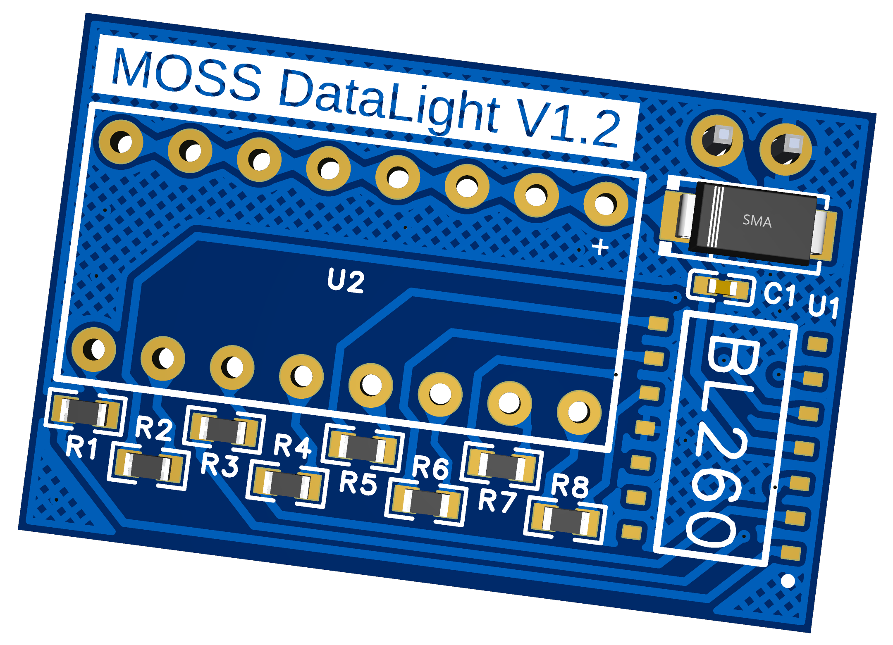
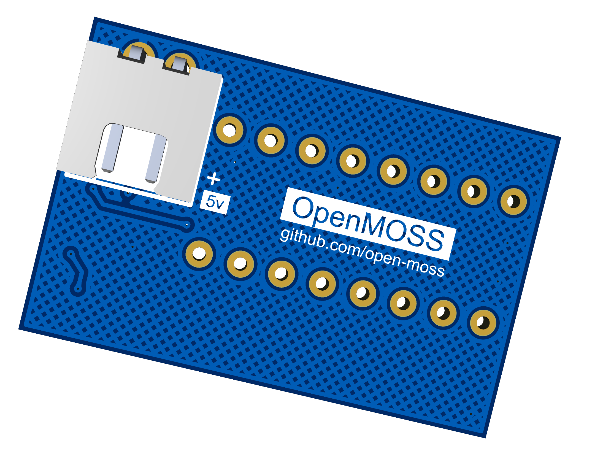

# MOSS DataLight PCB

## 简介

moss-datalight-pcb是[OpenMOSS](https://github.com/open-moss)的数据灯PCB工程（立创EDA）方案采用火焰灯IC（BL260）配合8段光条LED实现模拟MOSS数据灯的随机闪动效果，提供5V直流电源即可工作。

OpenMOSS交流群：238111072

| [了解OpenMOSS](https://github.com/open-moss)

## PCB预览图

